# Cloud_Infrastructure_14848
CMU 14848 Cloud Infrastructure and Design homework

`Docker Folder`

This folder has homework 2 screenshots for 14848 homework_2 

URL for docker image: https://hub.docker.com/repository/docker/varunkathuria/python-helloworld
___

`Sentiment-Analysis`

This folder has screenshots for Mini-Project-1.

Link to demo-video: https://youtu.be/K06V6PhaMyo

URL for docker images - 
- https://hub.docker.com/repository/docker/varunkathuria/sa-frontend
- https://hub.docker.com/repository/docker/varunkathuria/sa-webapp
- https://hub.docker.com/repository/docker/varunkathuria/sa-logic

Steps to run Sentiment Analyser on Google Kubernetes Engine on GCP -
- Build sa-logic ```docker build -f Dockerfile -t $DOCKER_USER_ID/sa-logic .```
- Push sa-logic image to docker hub ```docker push $DOCKER_USER_ID/sa-logic```
- Pull and tag sa-logic image via GCP cloud shell from dockerhub and then push it it GCP container registry.
- Navigate to sa-logic container on GCP. Deploy and expose the service on your cluster.
- Build java webapp project to get jar ```mvn install```
- Change SA_LOGIC_API_URL variable in sa-webapp Dockerfile to the external IP of sa-logic-service on GCP. Use the container port only. 
- Build sa-webapp ```docker build -f Dockerfile -t $DOCKER_USER_ID/sa-webapp .```
- Push sa-webapp image to docker hub ```docker push $DOCKER_USER_ID/sa-webapp```
- Pull and tag sa-webapp image via GCP cloud shell from dockerhub and then push it it GCP container registry.
- Navigate to sa-webapp container on GCP. Deploy and expose the service on your cluster.
- Change the POST URL in App.js of sa-frontend to the external IP of sa-webapp-service on GCP. Use the port 8080 only. 
- Build frontend using ```yarn build```
- Build sa-fronted ```docker build -f Dockerfile -t $DOCKER_USER_ID/sa-frontend .```
- Push sa-frontend image to docker hub ```docker push $DOCKER_USER_ID/sa-frontend```
- Pull and tag sa-frontend image via GCP cloud shell from dockerhub and then push it it GCP container registry.
- Navigate to sa-frontend container on GCP. Deploy and expose the service on your cluster.
- Access the sa-frontend-service and we have a working sentiment analyser deployed on GCP.
___

`NoSQL`

Added code file, data files and screenshots for query and results in the NoSQL folder.

___

`Project Checkpoint - Big Data Toolbox Application`

Added code file, and screenshots for Toolbox GUI and all delployments on GCP in the Course-project-checkpoint folder. There are also some yaml files which I used to test deploymenmts on minikube.

URL for docker images - 
- https://hub.docker.com/repository/docker/varunkathuria/frontend-terminal
- https://hub.docker.com/r/jupyter/minimal-notebook
- https://hub.docker.com/r/bitnami/spark
- https://hub.docker.com/layers/bde2020/hadoop-namenode/2.0.0-hadoop3.1.3-java8/
- https://hub.docker.com/layers/bde2020/hadoop-datanode/2.0.0-hadoop3.2.1-java8/
- https://hub.docker.com/repository/docker/varunkathuria/sonarqube-scanner

Steps to deploy images on Google Kubernetes Engine on GCP -

Firstly I created a new project and a new cluster on GCP for this toolbox project.
Screenshots for all the deployments and services on GCP -


### Detailed steps for deploying all images

#### Terminal GUI
  
1. Build terminal-fronted ```docker build -f Dockerfile -t $DOCKER_USER_ID/terminal-frontend .```
2. Push terminal-frontend image to docker hub ```docker push $DOCKER_USER_ID/terminal-frontend```
3. Pull and tag terminal-frontend image via GCP cloud shell from dockerhub and then push it it GCP container registry.
4. Navigate to terminal-frontend container on GCP. Deploy and expose the service on your cluster on port 80.
5. Access the terminal-frontend-service.


#### Jupyter

1. Pull and tag ```docker pull jupyter/minimal-notebook``` image via GCP cloud shell from dockerhub and then push it it GCP container registry.
2. Navigate to minimal-notebook container on GCP. Deploy and expose the loadbalancer service on your cluster on port 8888.
3. Access the jupyter-notebook via the jupyter-service URL.


  
#### Spark

1. Pull and tag ```docker pull bitnami/spark``` image via GCP cloud shell from dockerhub and then push it it GCP container registry.
2. Navigate to bitnami/spark container on GCP. While deploying the spark image, add the env variable SPARK_MODE=master and expose the loadbalancer service on your cluster on port 8080.
3. Access spark via the spark-service URL.


  
#### Hadoop Namenode

1. Pull and tag ```docker pull bde2020/hadoop-namenode:2.0.0-hadoop3.1.3-java8```  image via GCP cloud shell from dockerhub and then push it it GCP container registry.
2. Navigate to bde2020/hadoop-namenode container on GCP. While deploying the namenode image, add all the env variablse in ```hadoop.env``` file. Also set CLUSTER_NAME=mycluster env variable. Expose the loadbalancer service on your cluster on port 9000 and 9870.
3. Access hadooop namenode via the namenode-service URL.


#### Hadoop Datanode

1. Pull and tag ```docker pull bde2020/hadoop-datanode:2.0.0-hadoop3.1.3-java8```  image via GCP cloud shell from dockerhub and then push it it GCP container registry.
2. Navigate to bde2020/hadoop-datanode container on GCP. While deploying the namenode image, add all the env variablse in ```hadoop.env``` file. Also set SERVICE_PRECONDITION=http://namenode-service:9000 env variable. No need to expose this as a service.
3. Access hadooop datanode via the datanodes tab on namenode-service URL.

#### Sonarqube with sonar scanner

1. Build sonarqube-scanner with  ```docker build -f Dockerfile -t $DOCKER_USER_ID/sonarqube-scanner .``` This dockerfile will copy sonar scanner to sonarqube container and build the new image.
2. Push sonarqube-scanner image to docker hub ```docker push $DOCKER_USER_ID/sonarqube-scanner```
3. Pull and tag sonarqube-scanner image via GCP cloud shell from dockerhub and then push it it GCP container registry.
4. Navigate to sonarqube-scanner container on GCP. Deploy and expose the loadbalancer service on your cluster on port 9000.
5. Access sonarqube via the sonarqube-service URL.


___

`HW4 - Find the maximum temperature in NCDC data using hadoop on GCP`

Added screenshots for Hadoop-Mapreduce for 1901, 1902 and running on 1901 and 1902 together. I've also added screenshots for files on hadoop file system, cluster local file system and GCP bucket contents.

I ran mapreduce in 3 ways -
1. Only on 1901 to get max temp of every day for year 1901 - ResultsMax1901PerDay file
2. Only on 1902 to get max temp of every day for year 1902 - ResultsMax1902PerDay file
3. On 1901 and 1902 both together to get max temp of every day for year 1901 adn 1902 in same file - ResultsMax1901_1902PerDay file

(The results are merged based on the hash value, so  they might be out of order, but they have max temp of everyday for 1901 and 1902 years)

Steps to run map reduce on Hadoop on GCP -

1. Firstly I created a new dataproc cluster on GCP.
2. I added all the files - temperature_mapper.py, temperature_reducer.py, 1901 and 1902 to bucket of this cluster. 
3. Copied all the local files from the cluster to hadoop fs using ```gsutil cp gs://dataproc-staging-us-central1-548858251382-4ykzzv7k/filename .```

Summary - 
GCP buckets screenshot - 


GCP Cluster local files -

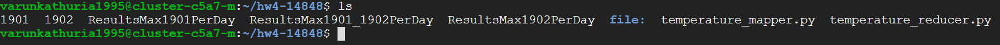

Hadoop file system files -


Deatailed steps for running map reduce on 1901 and 1902 - 

#### 1901
  
1. Run hadoop on 1901 ```hadoop jar /usr/lib/hadoop/hadoop-streaming.jar -files temperature_mapper.py,temperature_reducer.py  -mapper 'python temperature_mapper.py' -reducer 'python temperature_reducer.py' -input /1901 -output /OutputMax1901PerDay```
2. Merge reduced Results  ```hadoop fs -getmerge /OutputMax1901PerDay ResultsMax1901PerDay```
3. Copy results file to GCP bucket ```gsutil cp ResultsMax1901PerDay  gs://dataproc-staging-us-central1-bucketno/```


#### 1902
  
1. Run hadoop on 1902 ```hadoop jar /usr/lib/hadoop/hadoop-streaming.jar -files temperature_mapper.py,temperature_reducer.py  -mapper 'python temperature_mapper.py' -reducer 'python temperature_reducer.py' -input /1902 -output /OutputMax1902PerDay```
2. Merge reduced Results  ```hadoop fs -getmerge /OutputMax1902PerDay ResultsMax1902PerDay```
3. Copy results file to GCP bucket ```gsutil cp ResultsMax1902PerDay  gs://dataproc-staging-us-central1-bucketno/```


  
#### 1901 and 1902
  
1. Run hadoop on 1901 and 1902 together ```hadoop jar /usr/lib/hadoop/hadoop-streaming.jar -files temperature_mapper.py,temperature_reducer.py  -mapper 'python temperature_mapper.py' -reducer 'python temperature_reducer.py' -input /1902 /1901 -output /OutputMax1901_1902PerDay```
2. Merge reduced Results  ```hadoop fs -getmerge /OutputMax1901_1902PerDay ResultsMax1901_1902PerDay```
3. Copy results file to GCP bucket ```gsutil cp ResultsMax1901_1902PerDay  gs://dataproc-staging-us-central1-bucketno/```


___

`Course Project Final - Big Data Toolbox Application`

Video for demo - https://youtu.be/FS_dQYwGn7M

Implemented the following for the course project -
1. Containerized all four applications (Jupyter, Spark, Hadoop, SonarQube)
2. Deployed all containers to minikube for local testing.
3. Deployed all containers to Google Kubernetes Engine and GCP.
4. Build GUI to launch all the appllications on a button click!

Files 

URL for all the docker images used in this project- 
- https://hub.docker.com/repository/docker/varunkathuria/frontend-terminal
- https://hub.docker.com/r/jupyter/minimal-notebook
- https://hub.docker.com/r/bitnami/spark
- https://hub.docker.com/layers/bde2020/hadoop-namenode/2.0.0-hadoop3.1.3-java8/
- https://hub.docker.com/layers/bde2020/hadoop-datanode/2.0.0-hadoop3.2.1-java8/
- https://hub.docker.com/repository/docker/varunkathuria/sonarqube-scanner

Also included dockerfiles for frontend and sonarqube with sonarscanner. Also added yaml config files used for configuring nodes on minikube.

All deployments on GCP - 

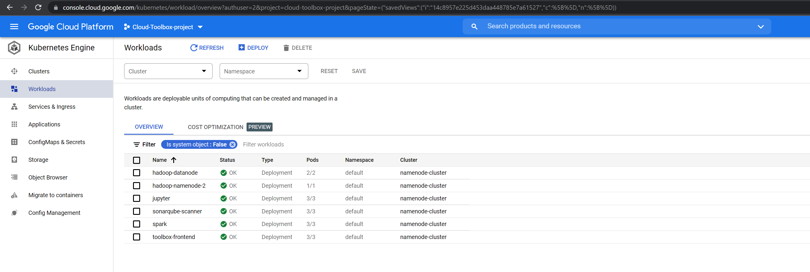

All containers deployed on GCP as services - 

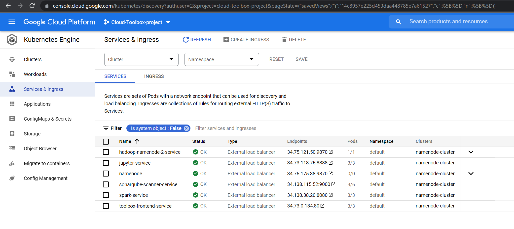


I've already added all the steps on how to build these images and deploy them on GCP in the checkpoint section [here](#detailed-steps-for-deploying-all-images).

1. Build and Deploy Toolbox Frontend GUI [here](#Terminal-GUI).

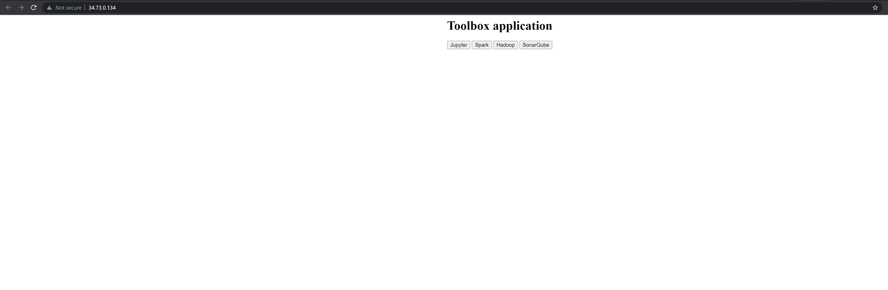

2. Build and Deploy Jupyter Notebook [here](#Jupyter).

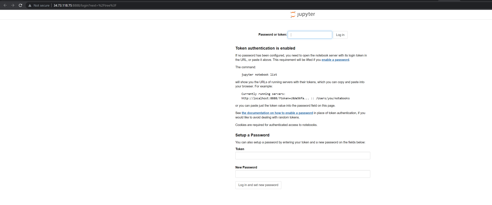

3. Build and Deploy Hadoop Namenode(replicas = 1) and Hadoop Datanode (replicas = 2) [here](#Hadoop-Namenode).

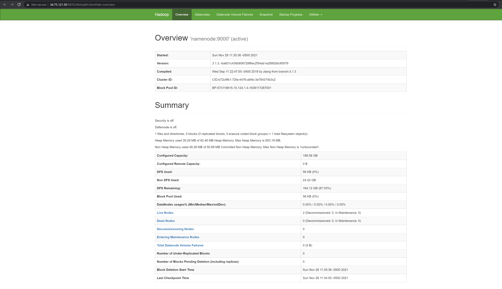

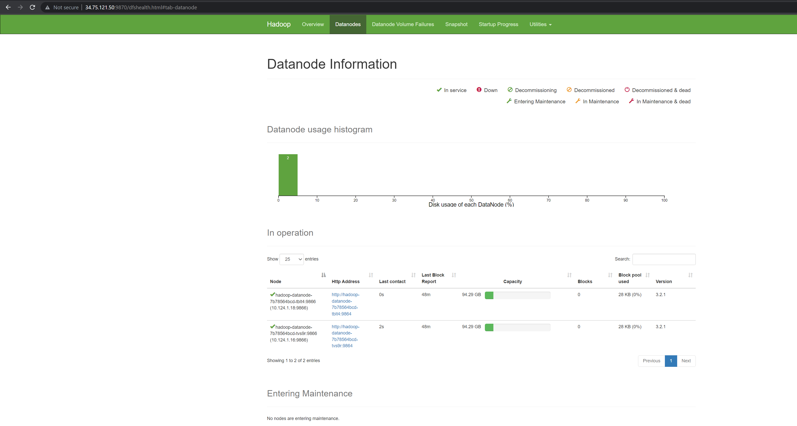

4. Build and Deploy Spark [here](#Spark).

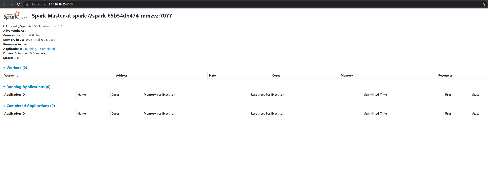

5. Build and Deploy Sonarqube with sonarscanner [here](#Sonarqube-with-sonar-scanner).

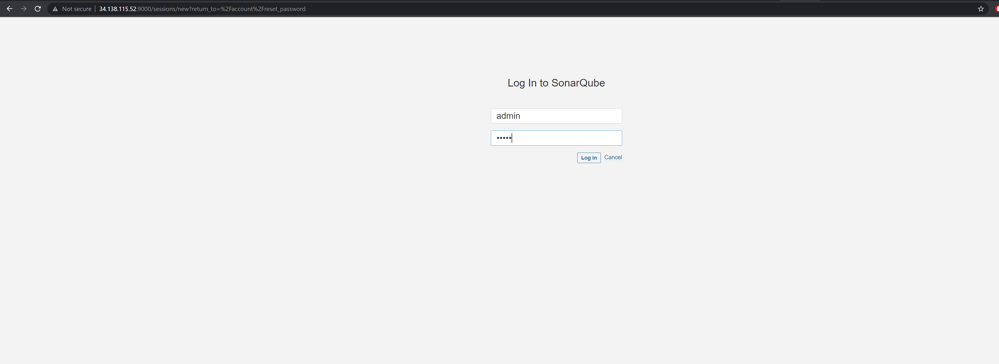

___

`HW5 - Inverted Index`

Steps:
1. Pull MML spark image from dockerhub using ```docker pull mcr.microsoft.com/mmlspark/release```
2. Run image as container ```docker run -it -p 8888:8888 mcr.microsoft.com/mmlspark/release```
3. Run ```jupyter notebook``` command in conatiner and access notebook via http://localhost:8888/
4. Unzip all files from data.zip in the textfile folder.

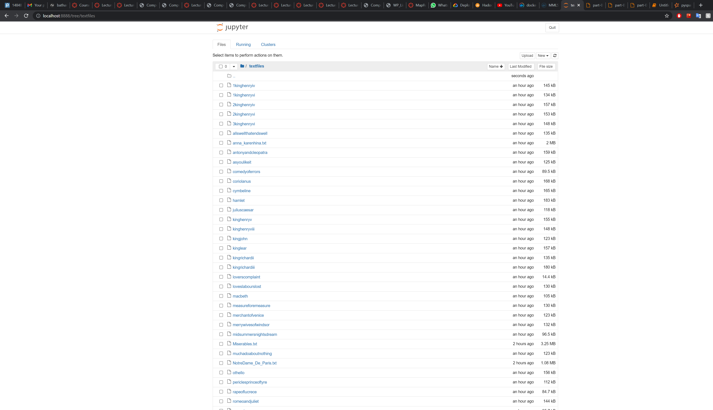

5. Run inverted_index.py

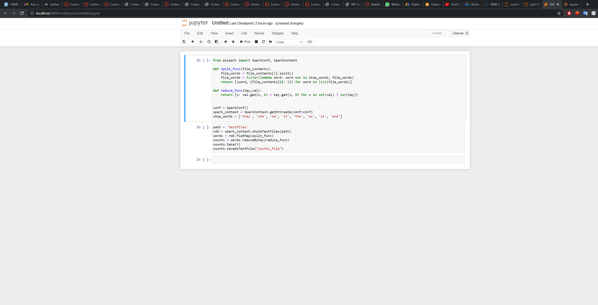

6. Output files are in counts_files folder

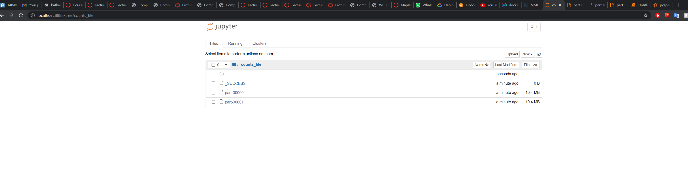


Output Examples:

('brother', {'file:/notebooks/textfiles/asyoulikeit': 15, 'file:/notebooks/textfiles/kingjohn': 13, 'file:/notebooks/textfiles/2kinghenryiv': 8, 'file:/notebooks/textfiles/othello': 1, 'file:/notebooks/textfiles/Miserables.txt': 65, 'file:/notebooks/textfiles/twogentlemenofverona': 1, 'file:/notebooks/textfiles/comedyoferrors': 3, 'file:/notebooks/textfiles/romeoandjuliet': 3, 'file:/notebooks/textfiles/2kinghenryvi': 4, 'file:/notebooks/textfiles/1kinghenryiv': 11, 'file:/notebooks/textfiles/tamingoftheshrew': 1, 'file:/notebooks/textfiles/war_and_peace.txt': 79, 'file:/notebooks/textfiles/titusandronicus': 17, 'file:/notebooks/textfiles/allswellthatendswell': 3, 'file:/notebooks/textfiles/anna_karenhina.txt': 130, 'file:/notebooks/textfiles/winterstale': 2, 'file:/notebooks/textfiles/1kinghenryvi': 1, 'file:/notebooks/textfiles/kinghenryv': 13, 'file:/notebooks/textfiles/kinglear': 5, 'file:/notebooks/textfiles/kinghenryviii': 2, 'file:/notebooks/textfiles/3kinghenryvi': 30, 'file:/notebooks/textfiles/kingrichardiii': 27, 'file:/notebooks/textfiles/kingrichardii': 6, 'file:/notebooks/textfiles/measureforemeasure': 34, 'file:/notebooks/textfiles/twelfthnight': 6, 'file:/notebooks/textfiles/timonofathens': 1, 'file:/notebooks/textfiles/tempest': 9, 'file:/notebooks/textfiles/juliuscaesar': 5, 'file:/notebooks/textfiles/NotreDame_De_Paris.txt': 38, 'file:/notebooks/textfiles/muchadoaboutnothing': 15, 'file:/notebooks/textfiles/hamlet': 3, 'file:/notebooks/textfiles/troilusandcressida': 11, 'file:/notebooks/textfiles/antonyandcleopatra': 7, 'file:/notebooks/textfiles/cymbeline': 10})


